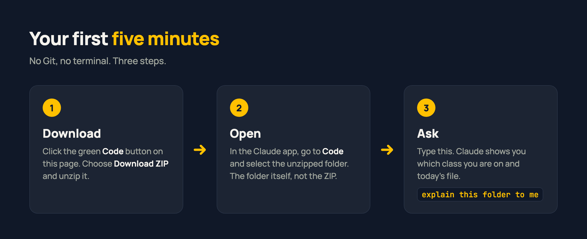
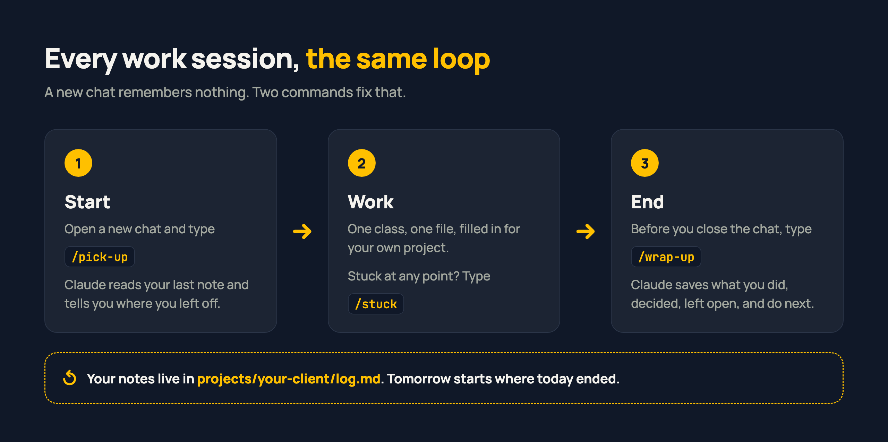
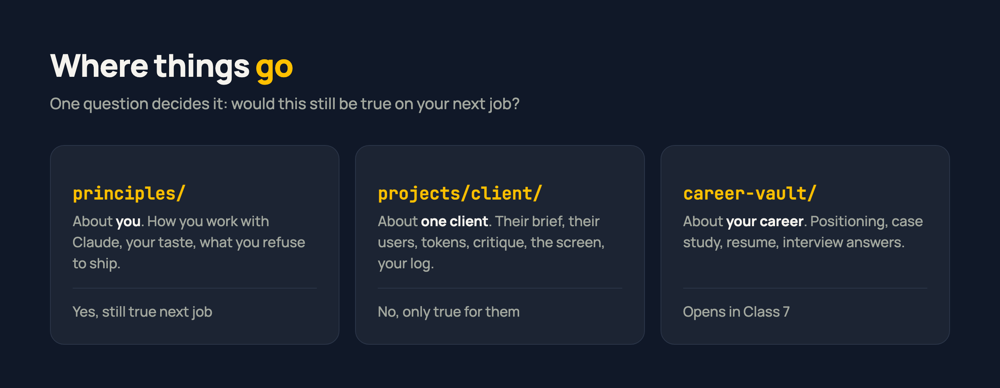

<p align="center">
  
  
  
  
  
</p>

# Claude for Designers

Your workspace for the Ostad course **Claude for UI/UX Designers**. You don't need to read this whole page. Do the three steps below, and Claude explains the rest.

## Start here



1. Click the green **Code** button at the top of this page, then **Download ZIP**, and unzip it. The folder may be called `claude-for-designers-main`, which is fine.
2. Open the Claude app, go to **Code**, and select the unzipped folder.
3. Type `explain this folder to me`.

That's all the setup there is. You don't need Git or a terminal, and nothing needs installing.

> **Before you start**
> - You need **Claude Pro**, about $20 a month. There is no free path for this course.
> - **Use your own account.** Shared accounts get locked mid-course.
> - Use **Sonnet 5 at medium effort** for everything.

## Every work session



A new chat remembers nothing from the last one. Two commands fix that:

- **Start** a session with `/pick-up`. Claude reads your last note and tells you where you left off.
- **End** a session with `/wrap-up`. Claude saves what you did, what you decided, what's still open and what comes next.

Your notes go into `log.md` inside your project folder. In Class 7 they become the raw material for your case study, because they hold every decision you made and the reason for it.

## One class, one file

Each class you fill in one file for your project and bring it back. That's the whole rhythm.

| Class | Topic | You fill in |
|---|---|---|
| 1 | What Claude is | Nothing in the folder yet. You work in a chat window |
| 2 | The working agreement | `claude-contract.md`, in `principles/` and in your project |
| 3 | The new brief | `brief-v3-interrogated.md`, `engagement.md`, `scope-email.md` |
| 4 | Claude as critic | `design-taste.md`, `anti-ai-slop.md`, `critique-notes.md` |
| 5 | Figma as source of truth | `tokens.md` |
| 6 | Building one real flow | `my-booking-screen.html`, plus files Claude writes for you |
| 7 | Brand and portfolio | `career-vault/01`, `02`, `06` |
| 8 | The interview | `career-vault/03`, `04`, `05` |

Every file opens the same way: why it exists, then a `YOUR TURN` section you answer in place.

## Your commands

Type `/` in Claude Code and the list appears. They're already installed.

| When | Type |
|---|---|
| Starting a session | `/pick-up` |
| Ending a session | `/wrap-up` |
| Something's broken or you're lost | `/stuck` |
| Before any design work | `/grill-me`, then `/design-brief` |
| Planning screens | `/information-architecture`, `/design-tokens`, `/brief-to-tasks` |
| Building | `/frontend-design` |
| Critiquing | `/design-review`, `/heuristic-evaluation`, `/persona-acid-test` |
| Applying for a job | `/application-pack` |

To learn what a command does, open its file in [`skills/`](skills/), where there's one readable file per command.

## Where things go



For your own client, duplicate the `projects/_new-client` folder and rename the copy. Never work inside `edubridge`, which is the course's worked example. You can also ask Claude: *"duplicate the _new-client folder and call it acme-fintech."*

## If you're stuck

1. **Type `/stuck`** and nothing else. Claude reads your folder, finds what's wrong, and tells you one fix. You don't have to explain the problem.
2. **If no commands appear when you type `/`,** check that you opened the folder itself, and the unzipped folder rather than the ZIP.
3. **If you're still stuck,** `/stuck` writes the message for you to post in the group chat.

---

<details>
<summary><b>More detail, for when you want it</b></summary>

### Why this exists

Claude with no context produces work that any agency could ship from the same prompt. The designers who stay valuable bring what Claude can't: a real brief, a real user, a real market, and the judgment to push back. This folder makes that context permanent, so you stop re-briefing Claude every conversation and the decisions stay yours.

### The worked examples

EduBridge Bangladesh is the running example, and every class demo uses it. Some files show the worked version inline, labelled as the example. Others ship blank, with the worked version next to them under the same name plus `.example`, for instance `engagement.example.md` next to `engagement.md`.

Write yours first, then compare. Comparing is the exercise; copying skips it.

### Three rules about where files go

1. **Root or project?** If it would still be true on your next job, it goes at root (`principles/`). If it's only true for this client, it goes in the project folder.
2. **Open the right folder.** Open Claude Code at the root for work about you, like your contract. Open the project folder for client work. The wrong level gives generic output, or lets one client's context leak into another's.
3. **Defaults at root, specifics in the project.** `principles/claude-contract.md` holds what you assume when a brief says nothing. `projects/<client>/context.md` holds that client's users and overrides those defaults.

### Practice briefs

No live client? `projects/_brief-bank/` has four practice briefs that aren't EduBridge: a desktop logistics dashboard, a Shopify storefront, a B2B landing page, and a Gulf booking app with Arabic and RTL.

`projects/_new-client/README.md` maps the eight classes onto a one-week engagement. The course takes eight classes to teach a process that takes about a week to run.

### The nine-step process


### Everything in the folder

```
claude-for-designers/
├── CLAUDE.md              what Claude reads when you open this folder
├── .claude/skills/        the commands, already installed. Never open it
├── principles/            about you: your contract, taste, what you refuse to ship
├── skills/                readable copy of every command. Edit these
├── projects/
│   ├── _new-client/       empty template. Duplicate it for every client
│   ├── _brief-bank/       four practice briefs
│   └── edubridge/         the worked example
└── career-vault/          positioning, case study, proposal, resume, interview
```

### Can't use the commands?

Open the command's file in `skills/`, paste the whole thing into your chat, then name the file you want it run on. The text is the same, so it behaves the same.

</details>

## Going deeper

- [**claudecodeguide.dev/for-designers**](https://claudecodeguide.dev/for-designers) has short guides for specific design workflows.
- [**Ostad: Claude for UI/UX Designers**](https://ostad.app) is the eight-class course this folder belongs to.

## License

MIT. Use it, change it, share it. Attribution is appreciated but not required.

Built by [Shadman Rahman](https://github.com/mshadmanrahman), product manager and former designer.
